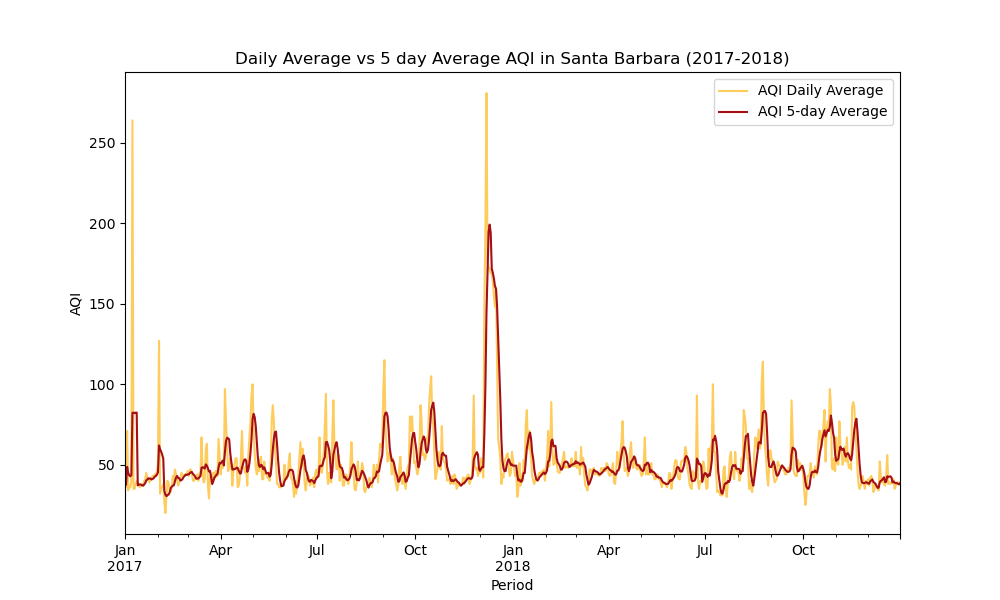
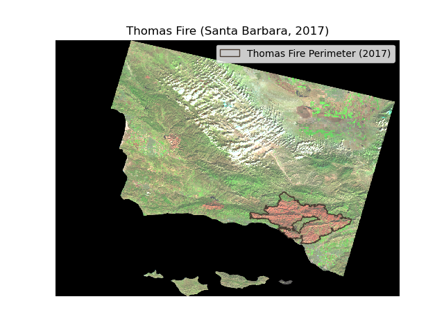

## Thomas Fire's Impact on AQI in Santa Barbara, CA (2017)

### Objective
The notebook provides a step-by-step data analysis of the impact of the Thomas Fire (2017) on air quality in Santa Barbara County.
The final outputs of the analysis include:

- A **Line Plot** depicting the time series analysis of the Air Quality Index (AQI) in Santa Barbara county for 2017 and 2018.</br>


- A **Map** with an overlay of the Thomas Fire scar on the Santa Barbara county land cover.</br>


### Data:

#### DataSet 1
[Air Quality Index (AQI)](https://www.airnow.gov/aqi/aqi-basics/) data from the [US Environmental Protection Agency](https://www.epa.gov)[1] to visualize the impact on the AQI of the 2017 Thomas Fire in Santa Barbara County [2].
- [2017 Daily AQI by County](https://aqs.epa.gov/aqsweb/airdata/daily_aqi_by_county_2017.zip)</br>
- [2018 Daily AQI by County](https://aqs.epa.gov/aqsweb/airdata/daily_aqi_by_county_2018.zip)

#### DataSet 2
A simplified collection of bands (red, green, blue, near-infrared and shortwave infrared) from the Landsat Collection 2 Level-2 atmosperically corrected surface reflectance data, collected by the Landsat 8 satellite [3]. **Note**: data should be used for visualization purposes only. 

#### DataSet 3
A prepared shapefile of fire perimeters in California during 2017[4].

**Note**: Data for datasets 2 and 3 is available on Google Drive in the file [thomasfire_aqi_analysis.zip](https://drive.google.com/file/d/1lDBPBy9378Zcj1g9Huhe8F_WeP4LZ7CN/view?usp=sharing). 

### File structure

### File structure

```html
<pre>
.
├── .gitignore
├── LICENSE
├── README.md
├── assets
│   ├── thomas_fire_aqi.png
│   └── thomas_fire_scar.png
├── data
│   ├── California_Fire_Perimeters_2017
│   │   ├── California_Fire_Perimeters_2017.cpg
│   │   ├── California_Fire_Perimeters_2017.dbf
│   │   ├── California_Fire_Perimeters_2017.prj
│   │   ├── California_Fire_Perimeters_2017.shp
│   │   └── California_Fire_Perimeters_2017.shx
│   └── landsat8-2018-01-26-sb-simplified.nc
└── thomasfire_aqi_analysis.ipynb
</pre>
```

### Citations:
[1] AirData Website File Download Page. https://aqs.epa.gov/aqsweb/airdata/download_files.html#AQI. Accessed 28 Nov. 2023.</br>
[2] “Thomas Fire.” Wikipedia, 9 Nov. 2023. Wikipedia, https://en.wikipedia.org/w/index.php?title=Thomas_Fire&oldid=1184323284.</br>
[3] Microsoft Planetary Computer. https://planetarycomputer.microsoft.com/dataset/landsat-c2-l2. Accessed 28 Nov. 2023.</br>
[4] California Fire Perimeters (All). https://gis.data.ca.gov/datasets/CALFIRE-Forestry::california-fire-perimeters-all-1/about. Accessed 28 Nov. 2023.

### Credits
Dr. Carmen Galaz García, Professor for EDS-220 - Environmental Data</br>
Yutian Fang, Teaching Assistant for EDS-220 - Environmental Data</br>
Bren School of Environmental Science & Management</br>
University of California, Santa Barbara